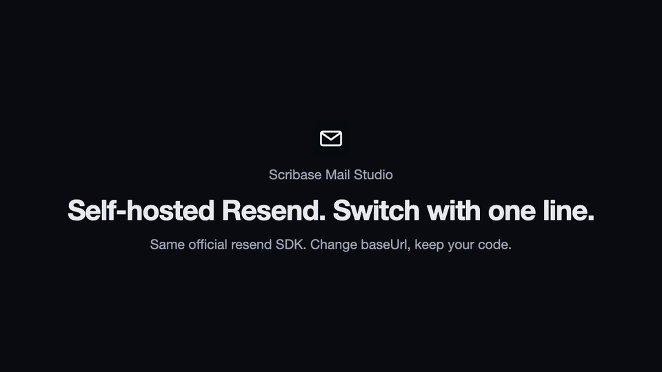

<p align="center">
  
</p>

<h1 align="center">Scribase Mail Studio</h1>

<p align="center">
  <b>Self-hosted Resend: switch with one line.</b><br>
  A Resend-compatible email API and dashboard you can run yourself or use hosted.
</p>

<p align="center">
  <a href="https://github.com/caelum0x/scribase-mail-studio/stargazers"></a>
  <a href="./LICENSE"></a>
  <a href="https://github.com/caelum0x/scribase-mail-studio/releases"></a>
  <a href="https://github.com/caelum0x/scribase-mail-studio/pkgs/container/scribase-mail-studio"></a>
  <a href="https://www.npmjs.com/package/resend"></a>
</p>

<p align="center">
  <a href="https://scribase.com/mail">Website</a> ·
  <a href="https://scribase.com/mail/migrate-from-resend">Migrate from Resend</a> ·
  <a href="./docs/SELF-HOSTING.md">Self-hosting</a> ·
  <a href="./apps/docs">Docs</a> ·
  <a href="https://mail.scribase.com/signup">Hosted (free tier)</a>
</p>

<p align="center">
  
</p>

## Switch with one line

Keep the official [`resend`](https://www.npmjs.com/package/resend) SDK and your
code. Point it at Scribase Mail Studio:

```ts
import { Resend } from "resend";

const resend = new Resend(process.env.RESEND_API_KEY, {
  baseUrl: "https://mail-api.scribase.com", // or your own instance
});

await resend.emails.send({
  from: "Acme <hello@acme.com>",
  to: ["you@example.com"],
  subject: "It works",
  html: "<p>Sent through Scribase Mail Studio.</p>",
});
```

No code change at all: set `RESEND_BASE_URL=https://mail-api.scribase.com`
(the SDK reads it). Webhooks are signed in the Svix format, so
`resend.webhooks.verify()` keeps working. Full guide:
[Migrate from Resend](https://scribase.com/mail/migrate-from-resend).

## Self-host in one command

Requires Docker with Compose v2.

```sh
git clone https://github.com/caelum0x/scribase-mail-studio && cd scribase-mail-studio && ./scripts/selfhost.sh
```

This generates secrets into `.env`, starts the app, Postgres, Redis and a local
[Mailpit](https://mailpit.axllent.org) inbox, and prints the URLs:

| What | URL |
| --- | --- |
| Dashboard | http://localhost:3000 |
| Resend-compatible API (`baseUrl`) | http://localhost:3000/api/resend |
| Local inbox (sign-in codes and test mail) | http://localhost:8025 |

Sign in with any address (the code lands in Mailpit), add a domain such as
`acme.test` (reserved names verify without DNS), create an API key and send
with the `resend` SDK. To send real mail, set `SMTP_HOST`, `SMTP_PORT`,
`SMTP_USER` and `SMTP_PASS` in `.env` to any SMTP relay (your own Postfix,
Oracle Cloud Email Delivery, or any provider with SMTP), clear
`COMPOSE_PROFILES`, and run `./scripts/selfhost.sh` again. DKIM is signed by
the app and the dashboard shows the DNS records to add. Production notes, TLS
and backups: [docs/SELF-HOSTING.md](./docs/SELF-HOSTING.md).

## Why

- **Resend API shape.** Emails (single, batch, scheduled, attachments, tags,
  idempotency keys), domains, API keys, contacts, audiences, segments, topics,
  broadcasts, templates, webhooks, suppressions and logs.
- **Your infrastructure, your data.** Postgres and Redis you control, AGPL
  source you can audit, and no usage bill when you self-host.
- **Inbound email.** Point MX at the bundled inbound server; messages show up
  under `/emails/received` and fire `email.received`.
- **Deliverability controls built in.** Warm-up caps for new senders,
  reputation auto-pause, content screening, a review queue, suppression lists,
  open and click tracking.
- **Agent-ready.** An MCP server (`packages/mcp-server`) and a CLI
  (`packages/cli`) for coding agents.
- **A real dashboard.** Campaign editor, contact books, double opt-in, one-click
  unsubscribe, team roles, 2FA and an audit log.

## Compared

| | Scribase Mail Studio | Resend | useSend | Postal |
| --- | --- | --- | --- | --- |
| Source code | AGPL-3.0 | Closed (SDKs MIT) | AGPL-3.0 | MIT |
| Self-host | Yes | No | Yes | Yes |
| Hosted plan | Yes | Yes | Yes | No |
| Works with the `resend` SDK via `baseUrl` | Yes | Yes | No | No |
| Sending path | Any SMTP relay | Managed | AWS SES | Own MTA and IPs |
| Inbound email | Yes | Yes | No | Yes |
| Svix-format signed webhooks | Yes | Yes | No | No |
| Hosted price for 50,000 emails/month | $20 | $20 | See their pricing | n/a |

Facts from each project's public README and pricing page as of October 2026.
Corrections welcome in an issue. Not affiliated with Resend.

Not supported yet, kept honest: automations and custom events, the Inboxes
API, OAuth apps, domain claim, and enforced TLS per domain (delivery uses
opportunistic TLS). Open a
[compatibility issue](https://github.com/caelum0x/scribase-mail-studio/issues/new?template=resend-compat.yml)
for anything else that differs.

## Hosted

Prefer not to run it? [mail.scribase.com](https://mail.scribase.com/signup) is
the same code, operated by us: Free (3,000 emails/month), Pro $20/month
(50,000 emails), Scale $90/month (100,000 emails), $0.90 per extra 1,000.
New teams from a company domain are approved automatically; sending starts on
warm-up limits. Details on [scribase.com/mail](https://scribase.com/mail).

## Local development

```sh
pnpm install
cp .env.example .env
pnpm dx:up            # Postgres + Redis in Docker
pnpm db:migrate-dev
pnpm dev              # http://localhost:3000
pnpm --filter=web test:unit && pnpm --filter=web typecheck
```

Stack: Next.js, Prisma (Postgres), Redis + BullMQ, tRPC, Hono for the public
API, NextAuth, Tailwind, nodemailer. See [CONTRIBUTING.md](./CONTRIBUTING.md).

## Credits and license

Scribase Mail Studio is a fork of [useSend](https://github.com/usesend/useSend)
by Koushik and the useSend contributors; the dashboard, public API, SDKs and
editor are largely their work. We added the Resend-compatible layer, the SMTP
and Oracle Cloud providers, inbound mail, Svix webhooks, abuse controls and
billing. See [MERGE.md](./MERGE.md) and [NOTICE](./NOTICE).

Licensed under the [GNU AGPL-3.0](./LICENSE). If you run a modified version
for users over a network, offer them its source; the app links to it from the
sidebar, login and unsubscribe pages.

If this saves you a Resend bill, a star helps others find it.
